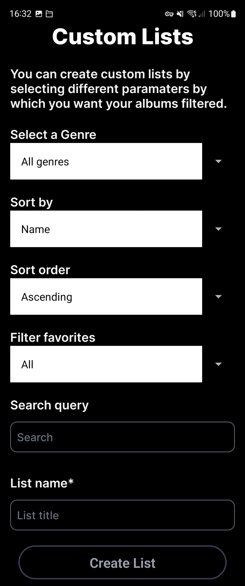
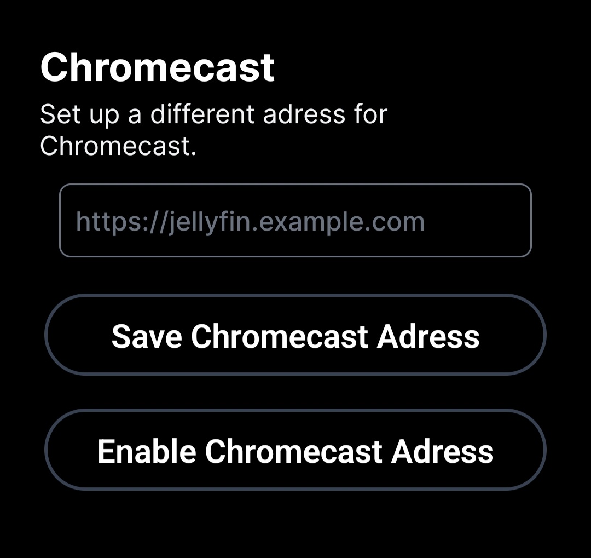

# Documentation

## Download Speed

Depending on your network direct downloads can be actually be signigicantly faster than download at a selected bitrate, since Jellyfin needs to transcode these using FFMPEG.

## Custom Lists

Custom Lists allow have shortcuts to predefined queries of your music library.

Examples:

- Genre: Jazz, SortBy: Random
- Genre: Classical, SortBy: Time added to library, Search Query: Bach
- Genre: Electronic, Filter: Favorites



## Chromecast

When using boum outside of your home network you should always connect to Jellyfin through a VPN connecting you to your home network, so that you're never exposing your Jellyfin server directly to this internet.


This means however that when trying to play music via Chromecast outside your home network, Chromecast cannot stream the music, since it can't access your Jellyfin server through the VPN. Luckily boum provides a solution to this. To illustrate this feature, let's take the following example:

Your Jellyfin servers adress is: `http://192.168.1.2:8096`. When you're in your home network you connect via it's local adress. When you're on the go, you connect back to your home network via Wireguard which means you can still access your Jellyfin server via it's local adress. You also expose Jellyfin through a reverse proxy on `https://jellyfin.example.com` with some kind of authentication proxy in front, let's say [Authelia](https://www.authelia.com/), so that friends can use your server without them needing access to your home network, all while not exposing your Jellyfin server to the Internet. Since Chromecast devices outside of your home network cannot access Jellyfin through the VPN, we need to add an excpetion to only to API endpoint(s) for streaming audio and - if wanted - covers to the authentication proxy, so that all APIs for managing Jellyfin are still locked down.

For Authelia you'd need to add this to your configuration:

```yaml:configuration.yml
access_control:
  default_policy: deny
  rules:
    - domain: "jellyfin.example.org"
      resources:
        - '^/audio([/?].*)?$'
      policy: bypass
    - domain: "*.example.org"
      policy: one_factor
```
