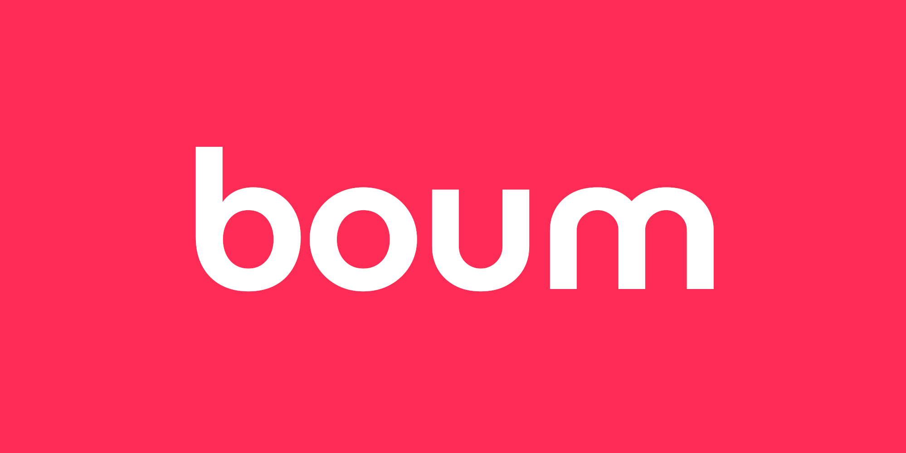
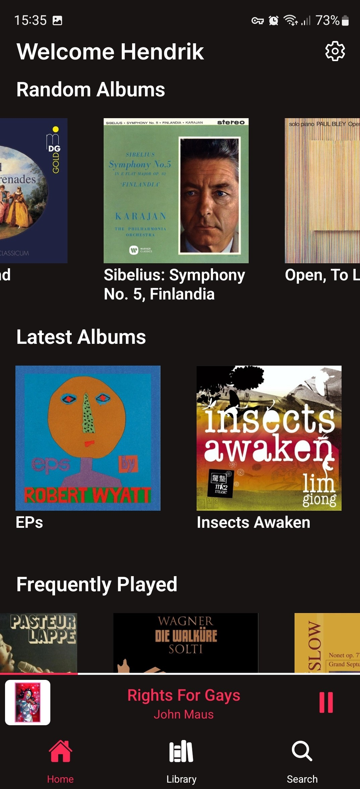
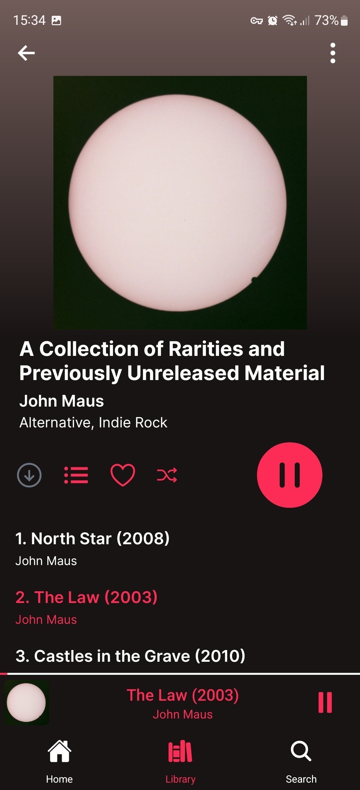
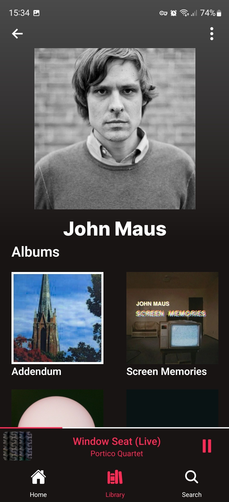
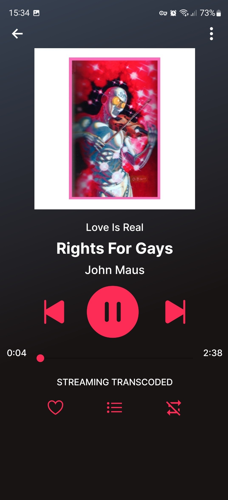
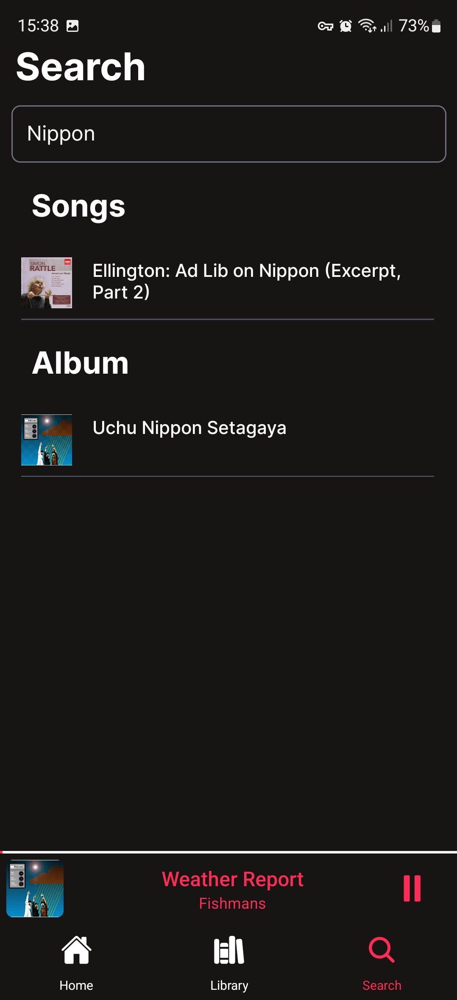
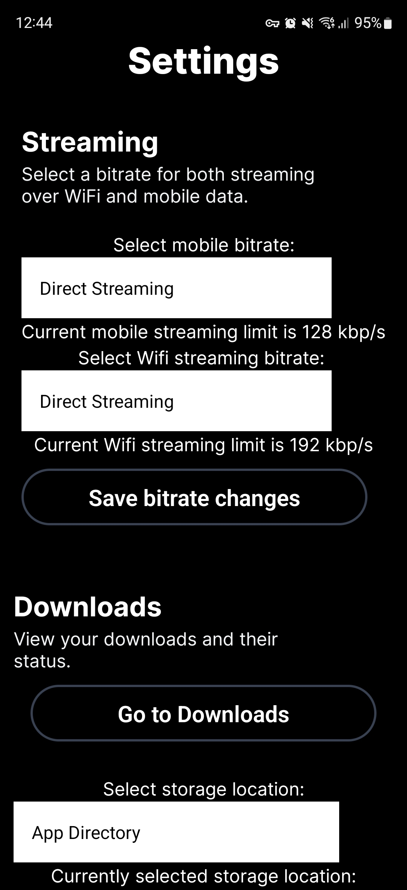

# boum

boum is a modern and sleek music app for [Jellyfin](https://github.com/jellyfin/jellyfin) media servers.

The name _la_ boum [bum], originates from the "cool" french word for party in the 80s. La boum is also the name of a [french classic](https://www.youtube.com/watch?v=D9KX35J1kWg).

☞ Want boum on iOS? [Consider sponsoring](https://github.com/henniaufmrenni/boum/issues/35)

  
  

## Features

- ability to download albums
- configurable download location
- offline mode to only view your downloaded albums
- unified search
- cross-navigation, eg. navigate from an album to the album artist and from the player screen to album / artist
- recommendations for similar artist on the artist screen and similar albums on the album screen
- ability to trigger a rescan of all the music libraries of your Jellyfin server
- streaming limit for both WiFi / mobile
- and more

  
  
  
  
  
  

## Documentation

The documentation for usage and development can be found [here](./DOCUMENTATION.md).

For issues and feature requests, please submit an [issue in the Gitub repository](https://github.com/henniaufmrenni/boum/issues) using the appropriate issue template and ensure that your request or report isn't a duplicate.

## Sponsors

Thank you to the sponsors who help to get towards [boum being in the Apple App Store](https://github.com/henniaufmrenni/boum/issues/35).

- [PowerUser64](https://github.com/PowerUser64)

## License

© Hendrik Stöldt & contributors

This software is licensend under the GNU General Public License v3.0 only, of which a copy can be found in the [LICENSE](LICENSE) file in the root of this repository.
